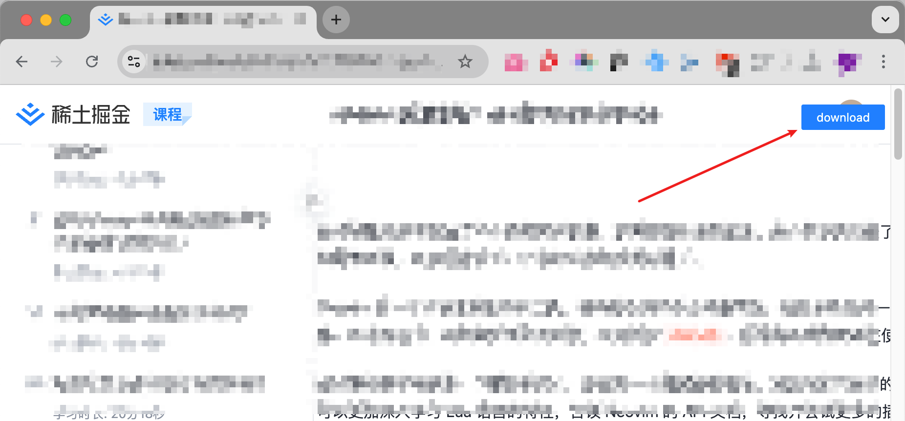

### 有啥用？

可以帮你下载掘金的课程成为 markdown 文档，并且把里面的图片链接保存到本地。(当然需要你有权限访问这个课程，比如购买对应的课程

### 怎么用？

`src` 目录中包括两个脚本，`js`油猴脚本会用来当前课程到本地，`python` 脚本用来把 `markdown` 中的图片下载转为本地文件。

- 浏览器安装油猴插件，然后把脚本添加进去这样，会展示出一个下载按钮，点击下载

  

- 下载的文件保存到 `raw` 文件中，执行

  ```
  cd src && python3 transfer.py
  ```
  转换之后的markdown 和图片会保存在 `processed_docs`目录中

### 免责声明
本工具仅供技术研究及合法用途使用。使用本软件前，请您务必仔细阅读并同意以下条款：
- 用户责任
您承诺仅将本软件用于个人学习、研究及合法授权的用途，禁止用于商业牟利、非法传播或其他违反《中华人民共和国著作权法》《信息网络传播权保护条例》等法律法规的行为。
若因用户行为导致版权方、平台或第三方权益受损，用户须独立承担全部法律责任，本软件开发者不承担任何连带责任。
- 免责条款
本软件按"现状"提供，开发者不承诺其稳定性、安全性或适用于特定用途，对因使用或无法使用本软件导致的直接或间接损失（包括但不限于数据丢失、账号封禁、法律纠纷等）概不负责。
开发者保留随时修改、暂停或终止本软件服务的权利，无需提前通知用户。
- 风险提示
使用本软件可能违反部分网站的服务条款，导致账号受限或IP封禁，用户需自行评估风险。
开发者不存储、不传播通过本软件获取的任何内容，不参与用户下载内容的分发或后续使用。
